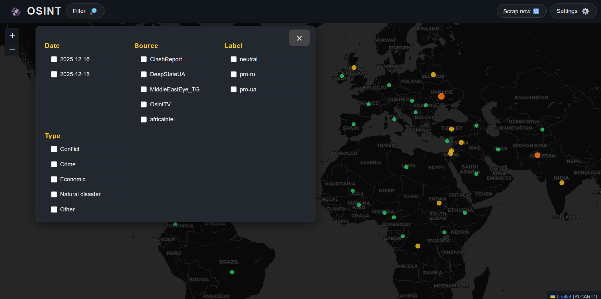
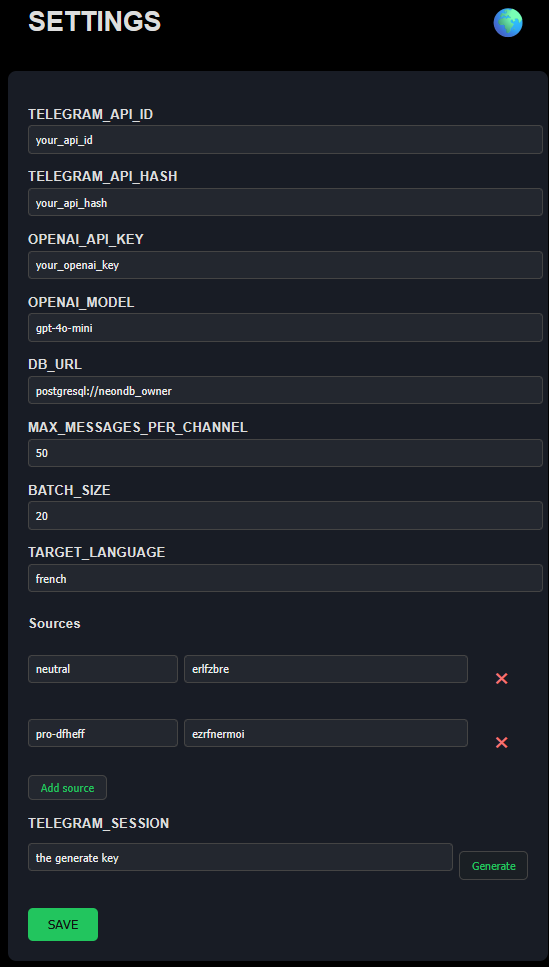

# 🛰️ OSINT Dashboard

Tableau de bord interactif pour l'analyse et la visualisation d'événements issus de sources ouvertes (OSINT), avec extraction automatisée depuis Telegram et enrichissement des données.

[](static/img/dashboard1.png)
[](static/img/env_editor.png)

## 🎯 Fonctionnalités principales

- **Collecte automatisée** de messages Telegram via API
- **Extraction et normalisation** des pays, types d'événements, labels, etc.
- **Traduction automatique** des messages (OpenAI)
- **Déduplication** et enrichissement des données
- **Visualisation web** : dashboard interactif (FastAPI + Jinja2 + JS)
- **Éditeur .env** intégré pour la configuration

---

## 💾 Installation rapide

-  **Cloner le repo**
   ```bash
   git clone https://github.com/Camprch/map-intel
   cd map-intel
   ```
-  **Installer les dépendances**
   ```bash
   python3 -m venv .venv
   source .venv/bin/activate
   pip install -r requirements.txt
   ```

---

## 🚀 Lancer l'application

```bash
uvicorn app.main:app --reload
```

- Accès au dashboard : [http://localhost:8000/dashboard](http://localhost:8000/dashboard)

---

## 🏗️ Structure du projet

- `app/` : code principal (API, modèles, services, utils)
- `static/` : fichiers statiques (JS, CSS, images)
- `templates/` : templates HTML (Jinja2)
- `data/` : base SQLite et données
- `tools/` : scripts utilitaires (pipeline, export, etc.)

---

## 📄 Licence

MIT
