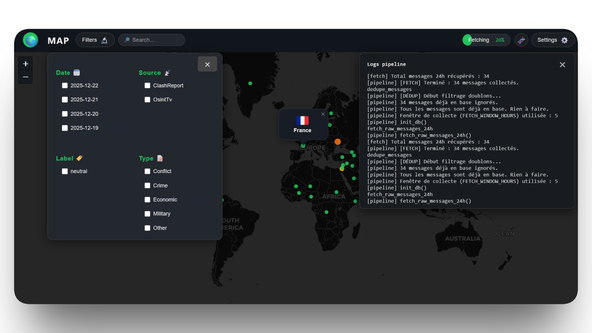
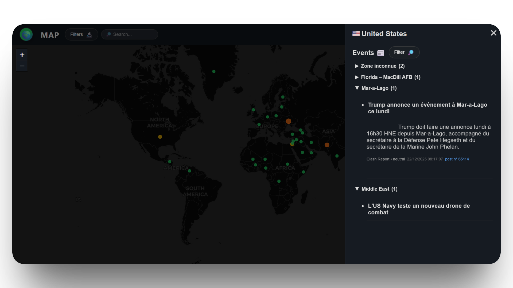
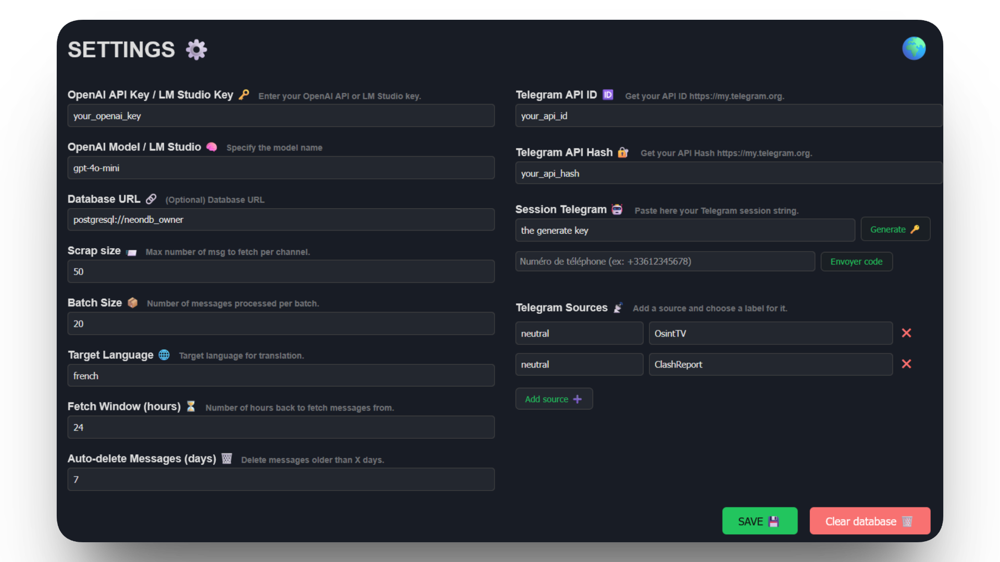
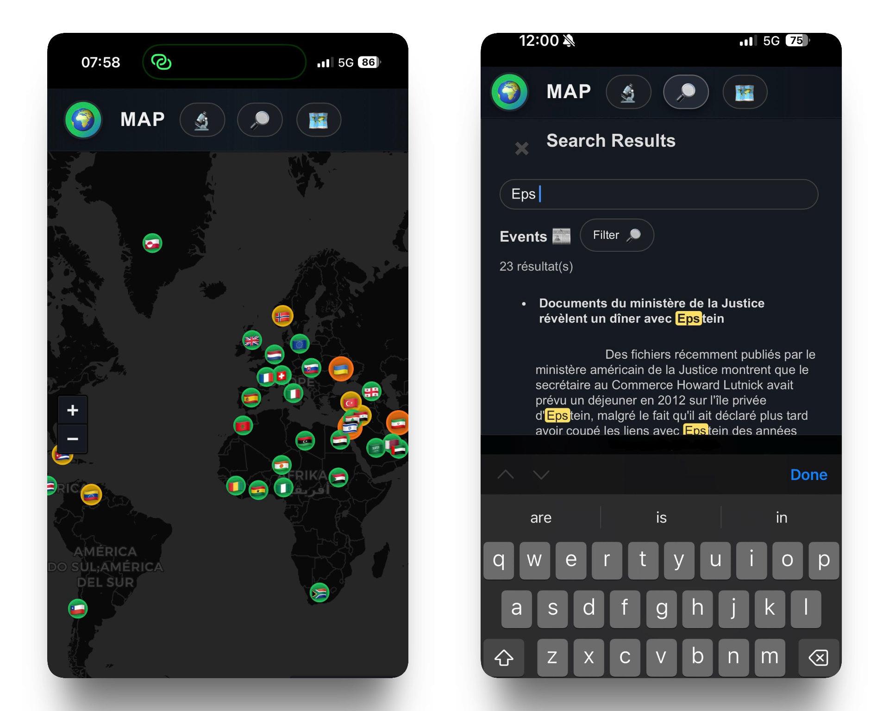

# 🛰️ OpenAtlas

🇫🇷 : Un outil complet conçu pour faciliter la veille informationnelle. Il automatise la collecte, la traduction, l'enrichissement et la visualisation globale d’événements issus de sources Telegram sélectionnées par l’utilisateur. 
Grâce à sa fonction de recherche avancée, il permet d’explorer rapidement et précisément la base de donnée.

🇬🇧 : OpenAtlas is an OSINT dashboard that automates Telegram data collection, translation, enrichment, and map-based visualization. It lets you explore events by country, date, label, and source, with a searchable database and an integrated .env editor for configuration.

[](static/img/desktop1.png)
[](static/img/desktop2.png)
[](static/img/desktop3.png)

## 🎯 Fonctionnalités principales

- **Collecte automatisée** de messages Telegram via API
- **Déduplication** des données
- **Enrichissement et normalisation** des pays, zones, types d'événements (heuristiques + IA en fallback)
- **Traduction automatique** des messages (IA)
- **Visualisation web** : dashboard interactif (fast api + leaflet)
- **Éditeur .env** intégré pour la configuration
- **Export static** intégré pour daily report

---

## 💾 Installation rapide

-  **Cloner le repo**
   ```bash
   git clone https://github.com/Camprch/OpenAtlas
   cd openatlas
   ```
-  **Installer les dépendances**
   ```bash
   python3 -m venv venv
   source venv/bin/activate
   pip install -r requirements.txt
   ```

---

## 🚀 Lancer l'application

```bash
uvicorn app.main:app --reload
```

- Accès au dashboard : [http://localhost:8000/dashboard](http://localhost:8000/dashboard)

---

## 📰 Export statique

OpenAtlas peut générer une version statique et légère du dashboard à partir des données de la base.
Cette version permet de consulter la carte des événements sans backend, idéale pour un partage public ou une publication automatisée.

```bash
python tools/build_static_site.py
```

Sortie :
- `static_site/index.html`
- `static_site/static/css/*`
- `static_site/static/js/*`
- `static_site/static/data/events.json` (données exportées)
- `static_site/static/data/countries.json`

Pour tester localement :
```bash
python -m http.server -d static_site 8001
```
Puis ouvrir `http://localhost:8001/index.html`.

[](static/img/mobile.png)

---

## 🏗️ Structure du projet

- `app/` : code principal (API, modèles, services, utils)
- `static/` : fichiers statiques (JS, CSS, images)
- `templates/` : templates HTML
- `data/` : base SQLite et données
- `tools/` : scripts utilitaires (pipeline, export, etc.)

---

## 📄 Licence

Projet 100% open source.
